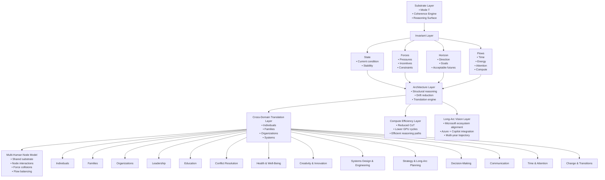
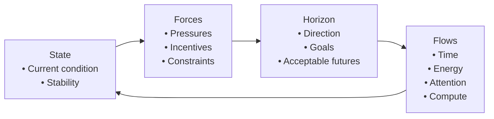
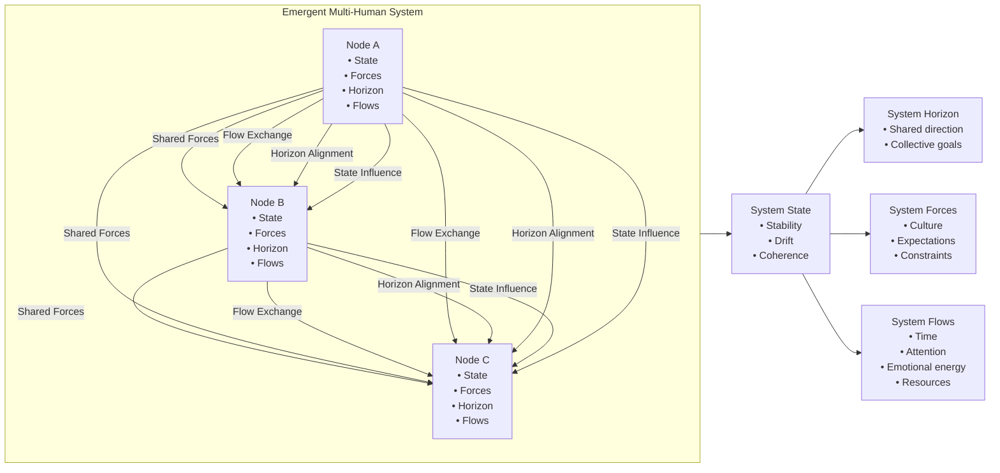

# REID Diagram Index
### Canonical Visuals for the REID Cognitive Architecture

This page collects all official REID diagrams into a single reference
location. These visuals represent the structural backbone of the
architecture and are intended for documentation, onboarding, research,
and integration work.

---

# 1. Master Architecture Diagram

---

# 2. REID Invariant Cycle

---

# 3. Multi‑Human Node Interaction Map

---

# 4. Usage

These diagrams may be referenced in:

- Architecture documents  
- Domain guides  
- Presentations  
- Research papers  
- Integration proposals  
- Microsoft ecosystem alignment work  

They represent the **canonical visual language** of REID.

---

# 5. Status

This diagram suite is **complete** for REID v3.1.1a.

